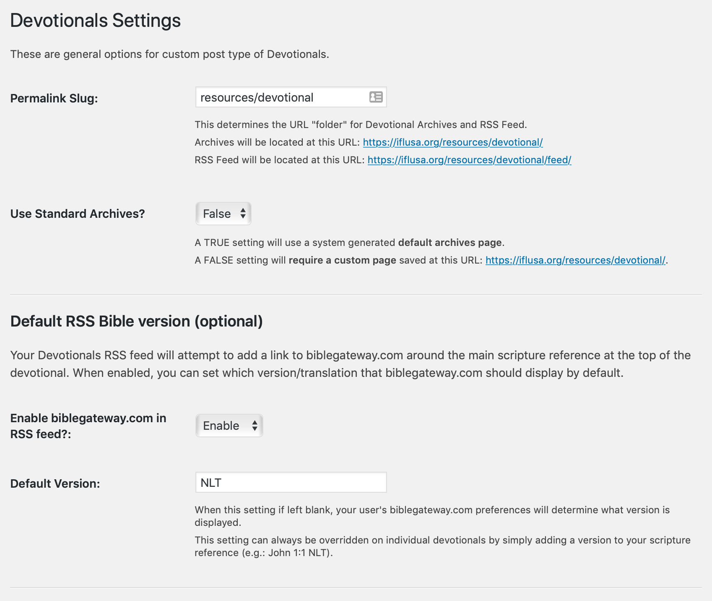
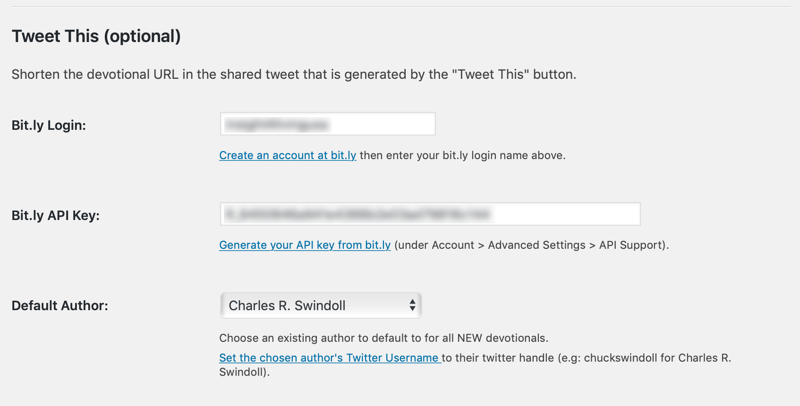

# IFLM Devotionals

* Contributors: [Will Murphy](https://github.com/willminsight)
* Tags: plugin, custom post type, devotionals, scripture references, footnotes, tweet this
* Requires at least: 4.9
* Requires PHP: 7.0
* Tested up to: 5.2
* Stable tag: [master](https://github.com/willminsight/devotionals/releases/latest)
* Donate link: <https://insight.org/donate>
* License: GPLv2 or later
* License URI: <https://www.gnu.org/licenses/gpl-2.0.html>

## Description

Create devotional posts on your ministry blog, including standard or custom archives and RSS Feed. You can also optionally include tweetable quotes. Features include:

* Linkable Scripture references, using any version accessible on biblegateway.com.
* Tweetable Quotes that allow you to automatically add a memorable quote from the devotional and a "Tweet This" button to the bottom of devotional.
* Tweetable Quote is automatically tied to the Author's user account twitter handle, but can be customized per devotional post.
* Footnote and copyright information can be easily added to bottom of each devotional.
* RSS Feed and Archives pages can use standard WP or customized urls to match your site's navigation and permalink stucture.
* RSS Feed is pre-formatted for Mailchimp and other RSS based content integrations.

## Screenshots

| Frontend | Settings |
|------------|-------------| 
|  |  | 
|  |  | 

## Change Log

### 1.2.7 - May 14, 2019
Added url encoding to tweetable quote text when used as a part of the "Tweet This" url.
